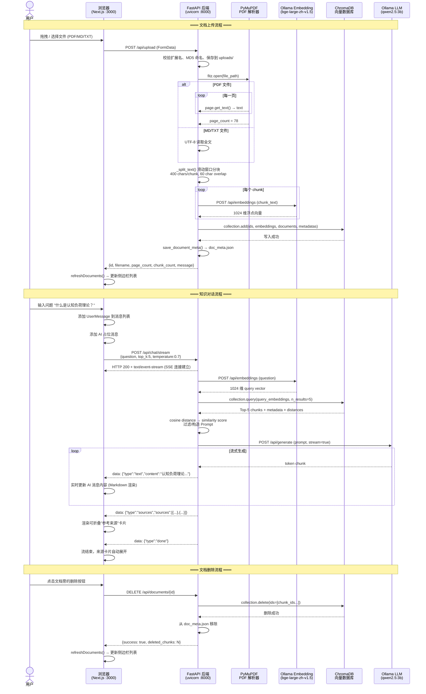

# MindLink AI 阶段总结报告

**日期**：2026-05-19
**项目**：MindLink AI — 本地个人知识内化 RAG 系统
**当前版本**：v2.0.0 MVP
**阶段状态**：MVP 端到端已通过，Ollama 环境待配置

---

## 一、技术栈

### 整体架构：FastAPI (后端) + Next.js 14 (前端) 分离架构

| 层级 | 技术选型 | 版本 | 用途 |
|------|---------|------|------|
| **后端框架** | FastAPI | 0.110+ | 异步 REST API + SSE 流式服务 |
| **前端框架** | Next.js (App Router) | 14.1.4 | React SPA，API 代理 |
| **RAG 编排** | LlamaIndex | 0.10.27 | Embedding 调用 + Ollama LLM 流式 |
| **向量数据库** | ChromaDB | 0.4.24 | 本地持久化向量存储，余弦距离 |
| **PDF 解析** | PyMuPDF (fitz) | 1.23.8 | 逐页文本提取，保留页码 |
| **LLM（默认）** | qwen2.5:3b (Ollama) | — | 1.9GB，中文指令微调模型 |
| **LLM（可选）** | DeepSeek / Claude API | — | Claude 兼容 API，SSE 流式 |
| **Embedding** | bge-large-zh-v1.5 (Ollama) | — | BAAI 中文 Embedding，1024 维 |
| **前端样式** | Tailwind CSS | 3.4.1 | 极简学术风主题 |
| **前端图标** | Lucide React | 0.356+ | 统一图标集 |
| **Markdown 渲染** | marked | 12.0+ | 客户端 Markdown → HTML |
| **文件上传** | react-dropzone | 14.2+ | 拖拽上传组件 |
| **前端状态** | React useState/useEffect | — | 轻量状态管理（未使用 React Query） |
| **通信协议** | REST + SSE | — | 文档管理 RESTful，对话 SSE 流式 |
| **API 代理** | Next.js rewrites() | — | `/api/*` → `http://localhost:8000/api/*` |
| **部署方式** | 本地双服务器 | — | uvicorn :8000 + next dev :3000 |

### Python 依赖 (`backend/requirements.txt`)

```
fastapi, uvicorn[standard], llama-index, llama-index-embeddings-ollama,
llama-index-llms-ollama, llama-index-vector-stores-chroma, chromadb,
pymupdf, python-multipart, pydantic, httpx
```

### Node.js 依赖 (`frontend/package.json`)

```
next, react, react-dom, lucide-react, marked, react-dropzone,
tailwindcss, autoprefixer, postcss, typescript
```

---

## 二、系统架构与数据流

### 2.1 系统拓扑

```
┌──────────────────────────────────────────────────────────┐
│                    用户浏览器 (localhost:3000)              │
│  ┌────────────────────┐  ┌─────────────────────────────┐ │
│  │    侧边栏 (360px)   │  │       主对话区 (flex-1)       │ │
│  │  · Logo + 项目名    │  │  · 顶栏（知识库统计）         │ │
│  │  · 拖拽上传区       │  │  · 消息列表（Markdown 渲染）  │ │
│  │  · 已索引文档列表   │  │  · 可折叠溯源卡片             │ │
│  │  · 模型参数调节器   │  │  · 输入框 + 发送按钮          │ │
│  └────────────────────┘  └─────────────────────────────┘ │
│                         │ fetch("/api/*")                 │
│                    Next.js rewrites() 代理                 │
└─────────────────────────┼───────────────────────────────┘
                          │
            http://localhost:8000/api/*
                          │
┌─────────────────────────┼───────────────────────────────┐
│              FastAPI 后端 (localhost:8000)                │
│                                                          │
│  ┌─────────────┐  ┌──────────────┐  ┌────────────────┐  │
│  │  main.py    │  │  pipeline.py │  │   engine.py    │  │
│  │  API 路由    │  │  文档处理管线  │  │   RAG 查询引擎  │  │
│  │             │  │             │  │                │  │
│  │ POST upload │──│ parse →     │  │  embed(query)  │  │
│  │ GET docs    │  │ chunk →     │  │  → search()    │  │
│  │ DELETE doc  │  │ embed →     │  │  → build_prompt│  │
│  │ GET config  │  │ store       │  │  → stream_llm  │  │
│  │ POST chat   │  │             │  │                │  │
│  └─────────────┘  └──────┬───────┘  └───────┬────────┘  │
│                          │                  │            │
│                   ┌──────┴──────┐    ┌──────┴──────┐     │
│                   │  ChromaDB   │    │ Ollama API  │     │
│                   │  (向量存储)  │    │ :11434      │     │
│                   │  ./data/    │    │             │     │
│                   │  chroma/    │    │ qwen2.5:3b  │     │
│                   └─────────────┘    │ bge-large   │     │
│                                      └─────────────┘     │
└──────────────────────────────────────────────────────────┘
```

### 2.2 文档上传数据流

```
用户选择文件 (PDF/MD/TXT)
  │
  ▼
[浏览器] FormData.append("file", file)
  │  POST /api/upload (multipart/form-data, max 50MB)
  ▼
[FastAPI main.py] 接收文件
  │  ├─ 校验扩展名 (.pdf/.md/.txt)
  │  ├─ MD5 哈希命名防止冲突
  │  └─ 保存到 ../uploads/
  ▼
[pipeline.py: index_document()]
  │
  ├─ Step 1: parse_document()
  │   ├─ PDF  → PyMuPDF 逐页提取 → {text, page_number, chunk_index}
  │   ├─ MD   → UTF-8 读取全文    → {text, page_number: null, chunk_index}
  │   └─ TXT  → UTF-8 读取全文    → {text, page_number: null, chunk_index}
  │
  ├─ Step 2: _split_text()
  │   └─ 滑动窗口：400 chars/chunk，60 chars overlap
  │
  ├─ Step 3: get_embed_model()
  │   └─ OllamaEmbedding(model="bge-large-zh-v1.5")
  │      POST http://localhost:11434/api/embeddings
  │      返回：1024 维浮点向量
  │
  ├─ Step 4: collection.add()
  │   └─ ChromaDB 批量写入
  │      ├─ ids: [uuid, ...]
  │      ├─ embeddings: [[1024 floats], ...]
  │      ├─ documents: [chunk_text, ...]
  │      └─ metadatas: [{document_id, filename, page_number, ...}, ...]
  │
  └─ Step 5: save_document_meta()
      └─ 写入 data/chroma/doc_meta.json
         {doc_id: {filename, source_type, page_count, chunk_count, created_at}}
```

### 2.3 知识对话数据流

```
用户输入问题
  │
  ▼
[浏览器 page.tsx] handleSend()
  │  POST /api/chat/stream
  │  Body: {"question": "...", "top_k": 5, "temperature": 0.7}
  ▼
[FastAPI main.py] → chat_stream()
  │  StreamingResponse (media_type="text/event-stream")
  ▼
[engine.py: stream_chat()]
  │
  ├─ Step 1: search_chunks(question, top_k)
  │   ├─ get_embed_model().get_text_embedding(question)
  │   │  └─ POST Ollama /api/embeddings → 1024-d vector
  │   └─ collection.query(query_embeddings=[vector], n_results=top_k)
  │      └─ ChromaDB 余弦相似度检索
  │      └─ distance → score: 1.0 - min(distance, 1.0)
  │      └─ 返回 Top-K SourceCitation 列表（按 score 降序）
  │
  ├─ Step 2: _build_system_prompt(sources)
  │   └─ 构造中文 Prompt：
  │      "你是一个严谨的学术研究助手。请基于以下参考资料回答问题..."
  │      参考资料：[1] 《文件》第N页: "文本片段..."
  │
  ├─ Step 3: 分流 LLM 后端
  │   ├─ LLM_BACKEND="ollama" → stream_chat_ollama()
  │   │   └─ Ollama(model="qwen2.5:3b").stream_complete(prompt)
  │   │      └─ POST http://localhost:11434/api/generate (stream)
  │   │
  │   └─ LLM_BACKEND="claude" → stream_chat_claude()
  │       └─ httpx.stream POST {ANTHROPIC_BASE_URL}/v1/messages
  │          Headers: x-api-key, anthropic-version
  │          SSE events: content_block_delta → text
  │
  └─ Step 4: SSE 事件流输出
      ├─ data: {"type":"text","content":"...","sources":[]}
      ├─ data: {"type":"text","content":"...","sources":[]}  ← N 次
      ├─ data: {"type":"sources","content":"","sources":[{...}]}
      └─ data: {"type":"done","content":"","sources":[]}
```

---

## 三、数据传输时序图



---

## 四、核心技术实现分析

### 4.1 文档处理管线 (`pipeline.py` — 306 行)

| 模块 | 技术 | 实现细节 |
|------|------|---------|
| PDF 解析 | PyMuPDF (fitz) | 逐页 `get_text()`，页码天然保留（1-indexed） |
| MD/TXT 解析 | Python 内置 `open()` | UTF-8 直接读取全文 |
| 文本分块 | 自定义滑动窗口 | 400 chars/chunk + 60 chars overlap（针对 bge-large-zh 512 token 限制） |
| Embedding | OllamaEmbedding (llama-index) | **手动调用** `get_text_embedding()`（非自动嵌入），逐块向量化 |
| 向量存储 | ChromaDB PersistentClient | 集合 `mindlink_docs`，`hnsw:space=cosine` |
| 元数据管理 | JSON 文件 | `doc_meta.json` 替代 ChromaDB 第二集合，包含 filename/page_count/chunk_count/created_at |
| Embedding 模型 | 全局单例 | `_embed_model` 惰性初始化，避免重复加载 |

### 4.2 RAG 查询引擎 (`engine.py` — 213 行)

| 模块 | 技术 | 实现细节 |
|------|------|---------|
| 向量检索 | ChromaDB `collection.query()` | 余弦距离查询，Top-K 可配置 |
| 相似度计算 | 自定义转换 | `score = 1.0 - min(distance, 1.0)`，按 score 降序排列 |
| Prompt 构造 | 中文 System Prompt | 含参考资料编号、文件名、页码、文本片段；要求忽略无关内容 |
| Claude 流式 | httpx AsyncClient | SSE 逐行解析 `content_block_delta` 事件，支持 DeepSeek 兼容 API |
| Ollama 流式 | llama-index-llms-ollama | `stream_complete()` 同步迭代器包装为异步生成器 |
| LLM 后端切换 | 环境变量 `LLM_BACKEND` | `"ollama"` 或 `"claude"` 动态路由 |

### 4.3 前端架构 (`page.tsx` — 598 行单文件)

| 模块 | 技术 | 实现细节 |
|------|------|---------|
| 布局 | Tailwind CSS Flexbox | 左侧 360px 固定 + 右侧 flex-1，无响应式断点 |
| 文件上传 | react-dropzone | 拖拽 + 点击，限制 PDF/MD/TXT，50MB |
| 文档列表 | useState + fetch | 挂载时加载，增删后刷新 |
| 聊天 SSE | fetch + ReadableStream | 手动 SSE 解析，buffer 管理不完整行 |
| Markdown 渲染 | marked.parse() + dangerouslySetInnerHTML | 实时渲染流式内容 |
| 溯源卡片 | 可折叠组件 | 自动展开，score < 0.6 半透明 |
| 模型参数 | HTML range input | Top-K (1-20) + Temperature (0-2, step 0.1) |
| 自动滚动 | scrollIntoView | 新消息/流式内容时触发 |

### 4.4 API 设计

| 方法 | 路径 | 请求类型 | 响应类型 | 说明 |
|------|------|---------|---------|------|
| POST | `/api/upload` | FormData (file) | JSON: UploadResponse | 文档上传 |
| GET | `/api/documents` | — | JSON: DocumentInfo[] | 文档列表 |
| DELETE | `/api/documents/{id}` | — | JSON: DeleteResponse | 文档删除 |
| GET | `/api/config` | — | JSON: ConfigResponse | 系统配置 |
| POST | `/api/chat/stream` | JSON: ChatRequest | SSE 流 | 流式对话 |

### 4.5 SSE 事件协议

```
每行格式: data: {"type":"<TYPE>","content":"<STRING>","sources":[...]}\n\n

事件类型:
  "text"     — 内容增量 (LLM token)，前端实时拼接
  "sources"  — 最终溯源列表，发送在 text 之后
  "done"     — 流结束标记
  "error"    — 错误信息（API 调用失败、超时等）
```

---

## 五、已实现功能

### 核心功能

| 功能 | 状态 | 说明 |
|------|:----:|------|
| PDF 文档上传与解析 | 已完成 | PyMuPDF 逐页提取，页码准确保留 |
| Markdown 文档上传与解析 | 已完成 | UTF-8 读取全文，滑动窗口分块 |
| TXT 文档上传与解析 | 已完成 | 同上 |
| 文档向量化与 ChromaDB 入库 | 已完成 | bge-large-zh-v1.5 1024-d 向量，批量写入 |
| 文档列表查询 | 已完成 | 按创建时间倒序排列 |
| 文档删除（含向量清理） | 已完成 | 级联删除 chunk + 元数据 |
| 系统配置查询 | 已完成 | 含知识库统计信息 |
| 语义向量检索 | 已完成 | ChromaDB 余弦距离 Top-K |
| 相似度评分转换 | 已完成 | distance → similarity score |
| 带引用溯源的 Prompt 构造 | 已完成 | 文件:页码格式标注 |
| SSE 流式对话 (Ollama) | 已完成 | llama-index Ollama 同步流式 |
| SSE 流式对话 (Claude API) | 已完成 | httpx 异步流式，含错误处理 |
| 双 LLM 后端动态切换 | 已完成 | 环境变量 `LLM_BACKEND` 控制 |

### 前端功能

| 功能 | 状态 | 说明 |
|------|:----:|------|
| 两栏布局（侧边栏 + 对话区） | 已完成 | 360px 固定左侧 + 弹性右侧 |
| 拖拽文件上传（含加载态） | 已完成 | react-dropzone，上传中 spinner |
| 已索引文档列表（含删除） | 已完成 | hover 显示删除按钮 |
| Top-K / Temperature 参数调节 | 已完成 | HTML range 滑块，实时生效 |
| 知识库状态显示 | 已完成 | 文档数/块数/模型名 |
| 流式对话消息渲染 | 已完成 | Markdown 实时渲染 |
| 用户/AI 消息气泡 | 已完成 | 差异化样式（蓝/灰） |
| 可折叠溯源卡片 | 已完成 | 文件名、页码、片段、相关度 |
| 低相关度来源半透明 | 已完成 | score < 0.6 → 50% opacity |
| 流式加载指示器 | 已完成 | 旋转动画 |
| 自动滚动到底部 | 已完成 | new message + streaming 触发 |
| 空状态引导 | 已完成 | "MindLink AI 已就绪，上传文档后开始对话" |
| API 代理 | 已完成 | Next.js rewrites `/api/*` → `:8000` |

---

## 六、未实现功能（含设计规划）

### 前端组件拆分（设计文档已规划，MVP 合并为单文件）

| 规划组件 | 文件路径 | 状态 |
|----------|---------|:----:|
| Sidebar.tsx | `components/sidebar/Sidebar.tsx` | 未拆分（在 page.tsx 内联） |
| FileUploader.tsx | `components/sidebar/FileUploader.tsx` | 未拆分 |
| DocumentList.tsx | `components/sidebar/DocumentList.tsx` | 未拆分 |
| ModelParams.tsx | `components/sidebar/ModelParams.tsx` | 未拆分 |
| ChatHub.tsx | `components/chat/ChatHub.tsx` | 未拆分 |
| ChatMessages.tsx | `components/chat/ChatMessages.tsx` | 未拆分 |
| MessageBubble.tsx | `components/chat/MessageBubble.tsx` | 未拆分 |
| SourceCard.tsx | `components/chat/SourceCard.tsx` | 未拆分 |
| ChatInput.tsx | `components/chat/ChatInput.tsx` | 未拆分 |
| Button.tsx | `components/ui/Button.tsx` | 未拆分 |
| Card.tsx | `components/ui/Card.tsx` | 未拆分 |
| Input.tsx | `components/ui/Input.tsx` | 未拆分 |
| Slider.tsx | `components/ui/Slider.tsx` | 未拆分 |
| Badge.tsx | `components/ui/Badge.tsx` | 未拆分 |

### Hooks 拆分

| 规划 Hook | 文件路径 | 状态 |
|-----------|---------|:----:|
| useChat.ts | `hooks/useChat.ts` | 未拆分 |
| useDocuments.ts | `hooks/useDocuments.ts` | 未拆分 |
| useUpload.ts | `hooks/useUpload.ts` | 未拆分 |

### 功能特性缺口

| 功能 | 设计文档状态 | 当前状态 | 说明 |
|------|:-----------:|:-------:|------|
| `.docx` 文档支持 | 计划中 | 未实现 | 已从 ALLOWED_EXTENSIONS 移除 |
| React Query 状态管理 | 计划中 | 未实现 | MVP 使用原生 useState/useEffect |
| React Query Providers | 计划中 | 未实现 | `providers.tsx` 未创建 |
| Shadcn UI 组件库 | 计划中 | 未实现 | 使用原生 HTML + Tailwind |
| 响应式布局（≤1024px） | 计划中 | 未实现 | 仅支持桌面端 |
| 汉堡菜单（移动端） | 计划中 | 未实现 | 无移动端适配 |
| 停止生成按钮 | 未规划 | 未实现 | abortRef 已定义但无 UI 触发 |
| 对话历史持久化 | 未规划 | 未实现 | 刷新页面后对话丢失 |
| 批量文档上传 | 未规划 | 未实现 | 目前已支持多文件，但逐个上传 |
| 上传进度条 | 未规划 | 未实现 | 仅有 spinner |
| 多知识库管理 | 未规划 | 未实现 | 单一 collection |
| 图片/扫描 PDF 支持 | 未规划 | 未实现 | PyMuPDF 仅支持文本层 PDF |
| Ollama 环境自动检测 | 未规划 | 未实现 | 后端启动无健康检查 |
| 测试套件 | 未规划 | 未实现 | CLAUDE.md 注明 "No test suite" |
| 错误重试机制 | 未规划 | 未实现 | SSE 断连后需手动重发 |
| Docker 部署 | 未规划 | 未实现 | 仅支持 Windows 本地运行 |

---

## 七、项目文件清单

```
mindlink-ai/
├── CLAUDE.md                          # AI 编码助手指南
├── backend/
│   ├── config.py                      # 配置常量（72 行）
│   ├── models.py                      # Pydantic 数据模型（59 行）
│   ├── pipeline.py                    # 文档处理管线（306 行）
│   ├── engine.py                      # RAG 查询引擎（213 行）
│   ├── main.py                        # FastAPI 入口（172 行）
│   └── requirements.txt               # Python 依赖
├── frontend/
│   ├── package.json                   # Node.js 依赖
│   ├── next.config.js                 # API 代理配置
│   ├── tailwind.config.ts             # Tailwind 主题
│   ├── postcss.config.js
│   ├── tsconfig.json
│   └── src/
│       ├── app/
│       │   ├── layout.tsx             # 根布局（zh-CN）
│       │   ├── page.tsx               # 主 SPA（598 行）
│       │   └── globals.css            # 全局样式 + Markdown
│       └── lib/
│           ├── types.ts               # TypeScript 类型（47 行）
│           └── api.ts                 # API 封装（33 行）
├── data/chroma/
│   └── doc_meta.json                  # 文档元数据（4 文档已索引）
└── uploads/                           # 上传文件缓存
```

---

## 八、已索引知识库现状

| 文件名 | 类型 | 页数 | 块数 | 索引时间 |
|--------|------|:---:|:---:|------|
| test-ml-doc.md | Markdown | — | 2 | 2026-05-08 20:16 |
| large-test.md | Markdown | — | 24 | 2026-05-08 20:46 |
| "知识内化"RAG 系统原始提示词.txt | TXT | — | 2 | 2026-05-08 20:50 |
| 高中生物知识点总结.pdf | PDF | 78 | 168 | 2026-05-13 15:46 |

**合计：4 个文档，196 个向量块，约 78,400 字索引**

---

## 九、当前阻塞项

1. **Ollama 环境未就绪**：Ollama 已下载安装（`E:\Ollama\ollama.exe`），但模型未拉取、服务未启动，导致 chat 功能不可用
2. **Claude API Key 不可用**：备选 DeepSeek API 路径需要有效的 `ANTHROPIC_AUTH_TOKEN`
3. **前端未组件化**：598 行单文件 page.tsx 可维护性差，需按设计文档拆分为独立组件
4. **无测试覆盖**：端到端流程仅通过手动 `curl` 验证

---

## 十、Git 历史

| Commit | 日期 | 说明 |
|--------|------|------|
| `7c16d5a` | 2026-05-13 | chore: 添加运行界面截图 |
| `1583820` | 2026-05-08 | feat: MVP 端到端测试通过 + 回答质量修复 |
| `1f7a1f0` | 2026-05-08 | fix: 交叉审查修复 — 消除 engine.py 重复单例、死代码，补全前端 DeleteResponse 类型 |
| `e66862f` | 2026-05-08 | chore: 清理旧 Next.js 代码，新建 backend/frontend 目录，添加 .gitignore |
| `51afecf` | 2026-05-08 | feat: MindLink AI 初始架构与设计文档，处理 npm 权限问题 |

当前分支：`master`，共 7 个 commit，未推送远程。
